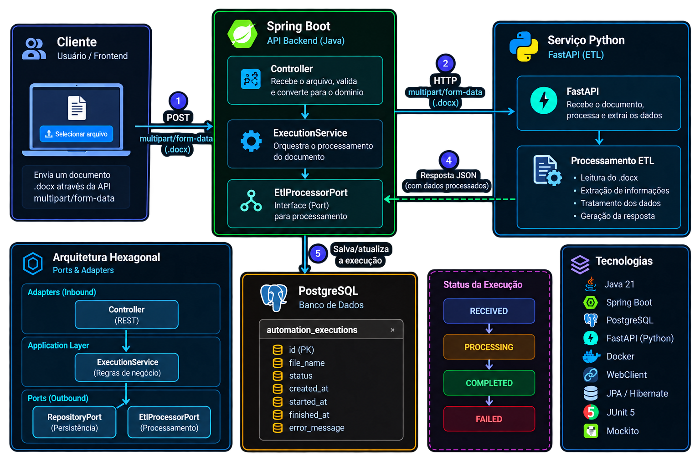

# 📄 DocFlow

API backend para **upload e processamento de documentos**, desenvolvida com **Java, Spring Boot e Arquitetura Hexagonal**, com integração entre serviços Java e Python através de HTTP.

O projeto foi desenvolvido com o objetivo de aplicar conceitos de desenvolvimento backend em um cenário próximo de uma aplicação real, separando as regras da aplicação dos detalhes de infraestrutura.

---

## 🎯 Objetivo

O **DocFlow** recebe arquivos `.docx` através de uma API REST e registra cada execução em um banco de dados PostgreSQL.

Após a validação do documento, o backend Java envia o arquivo para um serviço Python utilizando **Spring WebClient**.

O serviço Python, desenvolvido com **FastAPI**, recebe o documento e retorna uma resposta para a aplicação Java.

Após o processamento, a execução é atualizada no banco de dados.

---

## 🏗️ Arquitetura do Projeto



O backend Java utiliza princípios de **Arquitetura Hexagonal (Ports & Adapters)**.

A ideia é manter a regra da aplicação desacoplada das tecnologias externas.

O fluxo principal segue:

```text
Cliente
   ↓
Controller
   ↓
ExecutionService
   ↓
EtlProcessorPort
   ↓
PythonEtlAdapter
   ↓
WebClient
   ↓
FastAPI
```

O `ExecutionService` não precisa conhecer diretamente os detalhes de comunicação HTTP com o Python.

Ele depende da abstração:

```text
EtlProcessorPort
```

e o adapter:

```text
PythonEtlAdapter
```

implementa essa porta e realiza a comunicação com o serviço externo.

---

## 🔄 Fluxo da aplicação

```text
Cliente
   │
   │ POST multipart/form-data (.docx)
   ▼
Spring Boot API
   │
   ▼
Controller
   │
   ▼
ExecutionService
   │
   ├──────────────► PostgreSQL
   │                 RECEIVED
   │
   ▼
EtlProcessorPort
   │
   ▼
PythonEtlAdapter
   │
   │ WebClient / HTTP
   ▼
FastAPI
   │
   │ JSON Response
   ▼
Spring Boot
   │
   ▼
PostgreSQL
   │
   ▼
COMPLETED
```

---

## 🛠️ Tecnologias

### Backend

- Java
- Spring Boot
- Spring Web
- Spring Data JPA
- WebClient
- Maven

### Banco de Dados

- PostgreSQL
- JPA / Hibernate

### Serviço Python

- Python
- FastAPI
- Uvicorn

### Infraestrutura

- Docker
- Docker Compose

### Testes

- JUnit 5
- Mockito

### Ferramentas

- Git
- GitHub
- Postman
- IntelliJ IDEA

---

## 📤 Upload de documentos

A aplicação recebe documentos através de uma requisição:

```http
POST
Content-Type: multipart/form-data
```

Atualmente são aceitos arquivos:

```text
.docx
```

O Controller recebe o arquivo através de `MultipartFile` e o converte para um objeto interno `DocumentInput`.

```text
MultipartFile
      ↓
DocumentInput
      ↓
ExecutionService
```

Dessa forma, a camada de aplicação não precisa depender diretamente do `MultipartFile` do Spring.

---

## 🔗 Integração Java + Python

Uma das principais partes do projeto é a comunicação entre dois serviços.

O backend principal é desenvolvido utilizando:

```text
Java + Spring Boot
```

Enquanto o serviço responsável pelo processamento externo utiliza:

```text
Python + FastAPI
```

A comunicação ocorre através do **Spring WebClient**.

```text
Spring Boot
     │
     │ multipart/form-data
     ▼
WebClient
     │
     │ HTTP POST
     ▼
FastAPI
     │
     │ JSON
     ▼
EtlResponseDto
```

O arquivo é enviado como `multipart/form-data`.

A resposta JSON do FastAPI é desserializada pelo Spring para um `EtlResponseDto`.

---

## 💾 Persistência

Cada processamento gera uma execução registrada no PostgreSQL.

A aplicação trabalha com os seguintes estados:

```text
RECEIVED
PROCESSING
COMPLETED
FAILED
```

Isso permite representar o ciclo de vida de uma execução.

Exemplo:

```text
Documento recebido
       ↓
RECEIVED
       ↓
Processamento
       ↓
COMPLETED
```

Caso ocorra um erro durante o processamento:

```text
FAILED
```

---

## 🧪 Testes

O projeto utiliza:

- **JUnit 5**
- **Mockito**

Os testes são utilizados para validar as regras da aplicação e isolar dependências externas durante os testes unitários.

Entre os componentes testados estão:

```text
ExecutionService
ProcessingController
```

Os testes estão sendo desenvolvidos conforme a finalização do projeto.

---

## 📁 Estrutura simplificada

```text
src/main/java
│
├── adapters
│   │
│   ├── inbounds
│   │   └── controller
│   │
│   └── outbounds
│       ├── persistence
│       └── python
│
├── application
│   └── service
│
├── domain
│   └── model
│
├── ports
│   └── out
│
├── dto
│
└── infrastructure
```

Serviço Python:

```text
python/
│
├── controller/
│   └── etl_controller.py
│
└── main.py
```

---

## 🚀 Executando o projeto

### 1. Serviço Python

Entre no diretório:

```bash
cd python
```

Crie um ambiente virtual:

```bash
python -m venv .venv
```

Ative o ambiente e instale as dependências:

```bash
pip install fastapi uvicorn python-multipart
```

Execute:

```bash
python -m uvicorn main:app --reload
```

O serviço será iniciado em:

```text
http://localhost:8000
```

---

### 2. Backend Java

Execute a aplicação Spring Boot através da IDE ou Maven:

```bash
./mvnw spring-boot:run
```

A aplicação também necessita de uma instância PostgreSQL configurada.

---

## 🐳 Docker

O projeto utiliza **Docker** e **Docker Compose** para facilitar a configuração da infraestrutura e execução dos serviços.

A configuração Docker será responsável por executar os componentes da aplicação em ambientes isolados.

---

## 📚 Conceitos aplicados

Durante o desenvolvimento foram aplicados conceitos como:

- API REST
- Arquitetura Hexagonal
- Ports & Adapters
- Injeção de Dependências
- DTOs
- JPA / Hibernate
- PostgreSQL
- Multipart File Upload
- Comunicação entre serviços
- Spring WebClient
- Tratamento de exceções
- Logs
- Docker
- JUnit 5
- Mockito

---

## 📌 Status do projeto

🟡 **Em fase de finalização**

Fluxo principal atualmente funcional:

```text
Upload .docx
      ↓
Spring Boot
      ↓
Persistência
      ↓
WebClient
      ↓
FastAPI
      ↓
Resposta JSON
      ↓
COMPLETED
```

---

⭐ Projeto desenvolvido para estudo e aplicação prática de conceitos de desenvolvimento Backend e Arquitetura
